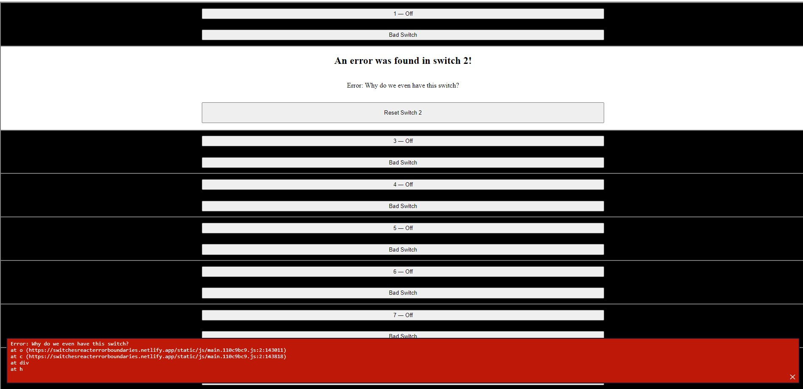

# Switches(React Error Boundary)

## Table of contents

- [Overview](#overview)
  - [The challenge](#the-challenge)
  - [Screenshot](#screenshot)
  - [Links](#links)
- [My process](#my-process)
  - [Built with](#built-with)
  - [What I learned](#what-i-learned)
  - [Continued development](#continued-development)
- [Author](#author)

## Overview

### The challenge

Users should be able to:

- View the optimal layout for the app depending on their device's screen size
- Can switch on and off with numbered switches.
- Bad switches should catch an error and show message in red box
- After error should be able to reset switch
- the last switch should create error to blank screen

### Screenshot

### Links

- Live Site URL: [View](https://switchesreacterrorboundaries.netlify.app/)

## My process

- Error boundaries are React components that wrap sections of a React application, catching runtime errors anywhere in their child component tree. They can render a fallback UI and log errors instead of just showing a blank screen. Error boundaries allow you to recover in the event of an error, which leads to a better user experience.
- React components become error boundaries once they implement one (or both) of the methods `static getDerivedStateFromError()` and/or `componentDidCatch()`. In order to use these methods, the error boundary must be a class component.
- The `static getDerivedStateFromError()` method receives the thrown error value and should return the error boundary’s next `this.state`. The error boundary’s new `this.state` value may be used to determine what to render: the fallback UI or the wrapped component tree. The `this.state` value can be reset to reset the error boundary and its children.
- The `componentDidCatch()` method is used to log the thrown error. It receives the thrown `error` and an `errorInfo` object as parameters. `errorInfo` has a `.componentStack` property containing the history of rendered components that led to the error.
- Typically, Error boundaries are created once and used multiple times throughout the application. It’s common to use third-party error boundary implementations such as `react-error-boundary`.
- The react-error-boundary package exports an `<ErrorBoundary>` component that can receive the props `onError` (which can be assigned a function for logging errors), and `FallbackComponent` (which can be assigned a fallback UI component).
- We can provide an inline function for the `FallbackComponent` prop to pass additional props to the fallback UI.
- Error boundaries should be kept as close to the source of the error as possible. Common places to use error boundaries are around new features that have not been thoroughly tested.

### Built with

- Semantic HTML5 markup
- CSS custom properties
- Mobile-Responsive Design
- JavaScript - Scripting language
- [React](https://reactjs.org/) - JS library

### What I learned

This was a class project to learn about context API.

### Continued development

maybe use later

## Author

- Website - [Cameron Howze](https://camkol.github.io/)
- Frontend Mentor - [@camkol](https://www.frontendmentor.io/profile/camkol)
- GitHub- [@camkol](https://github.com/camkol)
- LinkedIn - [@cameron-howze](https://www.linkedin.com/in/cameron-howze-28a646109/)
- E-Mail - [cameronhowze4@outlook.com](mailto:cameronhowze4@outlook.com)
